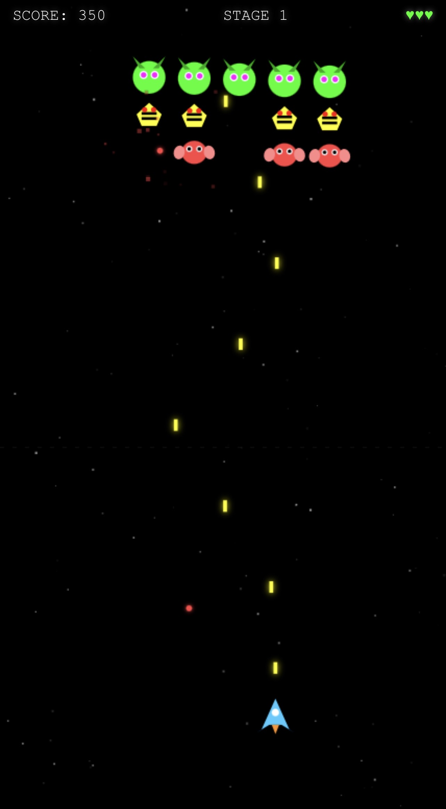

# Galaga Game - Development Notes & Lessons Learned

**[Play Galaga](https://raw.githack.com/rigrergl/temp/galaga-main/galaga.html)**



## Mobile Safari Essentials

### Viewport Setup
- Use `viewport-fit=cover` to handle notched phones
- Set `maximum-scale=1.0, user-scalable=no` to prevent zoom
- Add both `apple-mobile-web-app-capable` and `mobile-web-app-capable` meta tags
- **Never use CSS `100vh`** on Safari mobile — the address bar makes it too tall. Use `window.innerHeight` directly instead.

### Preventing iOS Annoyances
- `touch-action: none` on html/body
- `-webkit-touch-callout: none` and `-webkit-user-select: none` on `*`
- `-webkit-tap-highlight-color: transparent` to kill the tap flash
- `position: fixed; width: 100%; height: 100%` on html and body
- `overflow: hidden` everywhere
- Explicitly `e.preventDefault()` on all touch events with `{ passive: false }`
- Block pull-to-refresh by preventing touchmove on body/documentElement

### Canvas Sizing
- Set canvas width/height to `window.innerWidth` and `window.innerHeight`
- Also set `canvas.style.width` and `canvas.style.height` in px to match
- Listen for both `resize` and `orientationchange` (with a 200ms delay on orientation)
- Scale game units relative to a base phone size (390x844 for iPhone 14 Pro): `scale = Math.min(W / 390, H / 844)`

## Touch Controls That Actually Work

### The Offset-Drag Pattern
The best mobile control for this type of game is **offset-drag** — when the player touches, calculate the offset between their finger and the ship, then move the ship by that offset as they drag. This prevents the ship from teleporting to the finger position.

```js
touchZone.addEventListener('touchstart', function(e) {
    touchOffsetX = player.x - e.changedTouches[0].clientX;
});
touchZone.addEventListener('touchmove', function(e) {
    player.x = touch.clientX + touchOffsetX;
});
```

### Dedicated Touch Zone
Use a transparent div covering the bottom ~45% of the screen as the touch area. This prevents accidental touches on the game area from interfering. The div sits at `z-index: 4` above the canvas but below UI overlays.

### Auto-Fire
On mobile, making the player tap to fire while also dragging is awkward. Auto-fire via `setInterval` at the fire rate is much better — player just focuses on dodging.

## Game Architecture

### Scaling Everything
Every game dimension (ship size, bullet size, enemy size, speeds, gaps) should be multiplied by `scale`. This makes the game look correct on any screen size.

### Enemy Formation System
- Enemies stored in array with `homeX/homeY` (formation position) and `state` (formation/diving/returning)
- Formation sways left/right with a clamped `formationX` offset
- Individual enemies bob with a sin wave
- Dive behavior: enemy leaves formation on a curved sin path, wraps around bottom, returns from top
- Gap calculations must account for screen width: `gapX = Math.min(idealGap, screenWidth / cols)`

### Power-Up System
- 25% drop chance when enemy dies
- 4 types: Spread Shot, Mega Laser, Homing Missiles, Shield
- Each lasts ~8 seconds (480 frames) except Shield (3 hits)
- Rotating diamond pickup with letter icon
- HUD indicator that flashes when expiring
- Power-ups fall slowly and bob with a sin wave

### Weapon Implementations
- **Normal**: Double shot (two bullets offset left/right)
- **Spread**: 5 bullets in a fan pattern using angle offsets from -PI/2
- **Laser**: Rectangular beam from ship to top of screen, damages every 3 frames
- **Missiles**: Two homing projectiles that steer toward nearest enemy with angle-based turning (turnSpeed = 0.08 rad/frame), leave particle trails
- **Shield**: Visual ring around ship, absorbs hits, decrements HP

### Visual Effects
- **Screen shake**: Set a shake value, decay it by `*= 0.85` each frame, apply as random ctx.translate
- **Explosions**: Ring of 16 particles in a circle + one large white flash particle
- **Floating text**: Score popups that drift upward and fade out
- **Combo system**: Kill counter that resets after 60 frames of no kills, multiplies score up to 8x
- **Star field**: 150 stars with random hue (bluish), speed, size; bigger stars get a glow halo
- **Enemy glow**: `ctx.shadowColor` + `ctx.shadowBlur` on enemy draw calls
- **Thruster flames**: Two triangles with random flicker height + white inner core

## File Structure
Everything in one HTML file:
1. Meta tags and CSS at top
2. HTML structure: canvas, HUD, touch zone, start/game-over screens
3. Single `<script>` IIFE containing all game logic
4. No external dependencies

## Fire Rate
- 120ms between shots feels right for Galaga-speed action
- The original 220ms felt too slow and sluggish
